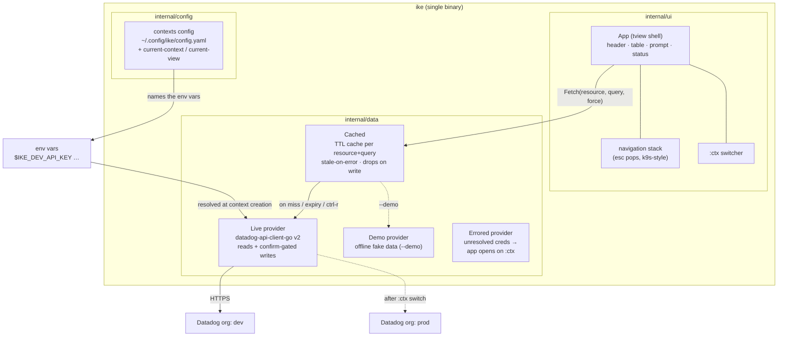
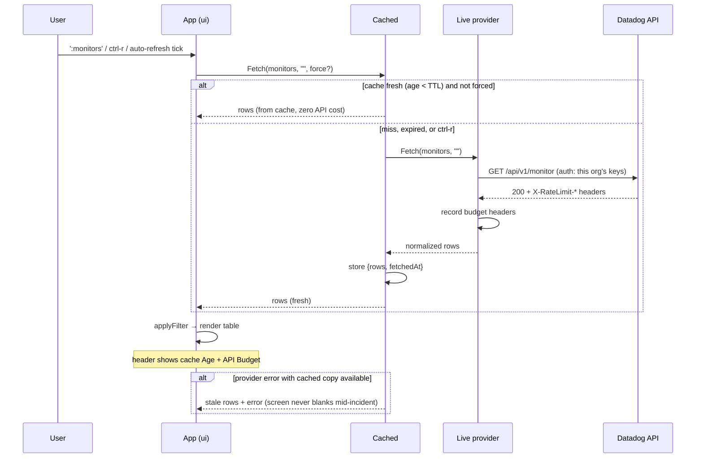
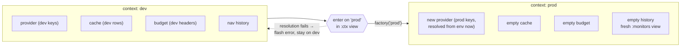
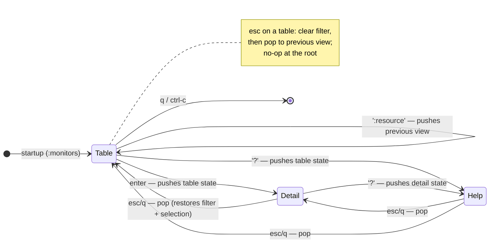

# ike — Architecture

Companion to [DESIGN.md](DESIGN.md) (which holds the *why*); this document is
the *what and how*. Diagrams are Mermaid — GitHub renders them inline.

## Components

One binary, three layers. The UI never talks to Datadog directly: everything
goes through the TTL cache, and the cache talks to a swappable `Provider`.

Key property: `Provider` is a single interface spanning **reads** (`Fetch`,
`FetchDetail`, `Dashboard`, `Trace`, `LogContext`, `Cost`, `MonitorMetric`,
`ListUsers`, `IncidentTodos`, `CurrentUser`), **confirm-gated writes** (`SetIncidentField`
for state/severity, `SetIncidentCommander`, `AddIncidentTodo`,
`SetIncidentTodoCompleted`, `DeleteIncidentTodo`, `SetMonitorMute`,
`CancelDowntime`) and **status** (`Budget`, `Mode`, `Site`). Three
implementations — `Live` (Datadog API), `Demo` (offline `--demo`), and
`Errored` (a placeholder for unresolved credentials, so a first run still opens
on `:ctx` to add or fix a context instead of exiting). Every write goes through
the `Cached` wrapper, which invalidates the affected resource so the next fetch
reflects the change. The demo provider implements the whole interface — every
read *and* write — which is what makes the entire TUI testable headlessly with
zero credentials.

## Data flow: one fetch

Datadog's API is rate-limited **per organization** (log search: 300 req/h),
so the cache is not an optimization — it is the core operational-safety
mechanism. See DESIGN.md § rate limits.

## Context switching (`:ctx`)

A context = one Datadog org (site + credentials), named in
`~/.config/ike/config.yaml`. Secrets are **never** in the file — a context
either names the env vars that hold its credentials (`api-key-env` +
`app-key-env`, or `token-env` for bearer/access-token auth), or is marked
`keychain: true` with secrets in the OS keychain (macOS Keychain / Linux
Secret Service). Strict YAML parsing rejects inline `api-key:` fields.
Contexts can be managed in the TUI: `:ctx` → `a` opens an add form whose
Auth dropdown (OAuth / API+APP keys / access token) drives which fields
show, with an inline guidance panel; `e` opens the same form pre-filled to
edit the selected context (auth type, site, subdomain, or rotate secrets;
empty secret fields keep the stored ones); `ctrl-d` deletes (confirm modal;
active context protected). The UI performs these through injected
`AddContext`/`AddOAuthContext`/`UpdateContext`/`OAuthLogin`/`DeleteContext`
callbacks — it never touches YAML or the keychain itself.

A switch is a hard boundary: different org means different data and a
different rate-limit budget, so everything org-scoped is torn down.

Startup context selection precedence: `--context` flag →
`$IKE_CONTEXT` → `current-context` in the config file. With no config file
at all, the classic `DD_API_KEY`/`DD_APP_KEY`/`DD_SITE` env vars become an
implicit `default` context, so pre-contexts usage keeps working.

**OAuth login.** `ike auth login` implements the native flow proven by
`hack/oauth-spike`: unauthenticated dynamic client registration, browser
authorization with PKCE (S256) against the org's app host, a loopback callback
on `127.0.0.1:53682`, and the token exchange. Tokens live in one keychain entry
per context; the live provider gets a *token source* that refreshes lazily
(within 60s of expiry, single-flight, persisted back). The config records only
`{site, subdomain?, org?, keychain: true, auth: oauth}`. `internal/auth` is
endpoint-injectable and covered end to end against httptest fakes. The same core
(`loginContext`) backs the in-app path: `:ctx` → `a` chooses the auth type, and
`O` runs the row-scoped login — signing in an OAuth context or converting a
key/token one (behind a confirm, which also clears the old keychain secrets).

**Multi-context spanning.** Contexts activated with space in `:ctx` each get
their own provider + TTL cache (a `providers` map keyed by context name; the
current context is always active). Spanning views fan out one `Fetch` per
active org in parallel, tag every row with its origin org (`Row.Ctx`), merge
(monitors alert-first, time-lined views newest-first), and render a
display-only `CTX` column. Every row-scoped call — detail, drill-down, write,
the user picker — routes through `providerFor(row)` to the row's org, so
nothing crosses org boundaries. One org failing still renders the others'
rows plus an error flash; the header shows one budget line per active org.

**Session restore.** The active org and view are persisted as you navigate
(`current-context` + `current-view`, written on a `:ctx` switch and on a
`:<resource>` command via a `PersistSession` callback — drill-downs stay
transient), so a new session reopens where you left off. At launch a brief
full-screen **splash** (the `IKE` logo + version) shows while the first view
loads underneath, dismissed after ~1.2s or on any key.

## Navigation model

Mirrors k9s's page stack (`Pages` + `model.Stack` in k9s): every navigation
pushes the current state — resource, filter, selected row — and esc pops it.
Esc also clears an active filter on the way out (k9s `resetCmd` semantics).

The `:ctx` view is a pseudo-resource: rendered through the same table
pipeline (filter, colors, selection) but served from the app's own context
list instead of a Provider, and `enter` switches org instead of opening a
detail view.

The diagram shows the core states; the same push/pop stack drives the other
overlay pages too — the dashboard grid, the trace waterfall, log patterns
(`P`), the log surrounding-context panel (`x`), the cost panel (`:cost`), the
saved-query picker (`Q`), `:settings`, the column picker (`C`), the
searchable user picker (`I` / to-do assignee) and the incident to-do panel
(`T`) — each pushes the prior view and esc pops it. The startup splash is the
one exception: it is shown as its own transient full-screen root (a
`SetRoot` swap), outside the navigation stack.

## Security model

Reviewed 2026-07-14 (manual audit + govulncheck); full threat model in
[SECURITY.md](../SECURITY.md). The load-bearing controls, and where they
live:

| Control | Where |
|---|---|
| Site allowlist — creds only ever go to `api.<known site>` | `config.Sites` + `config.Load` validation; the :ctx dropdown reads the same list |
| No secrets in the config file (strict YAML, env/keychain only) | `config.Load` (`KnownFields`), `config.KeyringStore` |
| Atomic config writes, 0600/0700 modes | `config.Save`, log setup in `main.go` |
| No secret ever logged | logging sites in `internal/ui` record auth *kind* / context *name* only |
| https-only browser opens; no shell interpolation | `App.openURL`, `exec.Command` arg arrays throughout |
| Toolchain + dependency hygiene | `toolchain` pin in go.mod, govulncheck CI job, Dependabot |

## Package layout

| Path | Responsibility |
|---|---|
| `main.go` | flags, config loading, provider factory wiring |
| `internal/config` | contexts file: parse, validate, resolve env-indirected secrets |
| `internal/data` | `Provider` interface, `Cached` TTL cache, `Live` (Datadog API), `Demo` |
| `internal/ui` | tview shell, navigation stack, `:ctx` switcher, rendering |

Dependency direction is strictly `ui → data ← config` (via main); `data`
knows nothing about tview, `ui` knows nothing about YAML or env vars.

## Testing strategy

No pty, no credentials, no network:

- `internal/config`: table-driven unit tests (valid/implicit/reject-plaintext,
  `current-context`/`current-view` round-trip).
- `internal/data`: wire-shape unit tests for the writes that can't be exercised
  from the sandbox — the nested-nullable commander-assign body and the to-do
  completion PATCH — assert the exact JSON Datadog expects.
- `internal/ui`: the real `App` runs on a tcell `SimulationScreen`; tests
  inject keystrokes and assert on the rendered screen text. This covers command
  mode, filters, quick filters, help, detail, esc-history, context switching,
  the confirm-gated writes (mute, incident state/severity/commander-picker,
  to-do panel add/complete/delete), the startup splash, and session restore
  (switch org+view → relaunch reopens there) — all end-to-end.
- `TestScreenDump` (`IKE_DUMP=1`) regenerates the README screenshots from
  the same harness.
