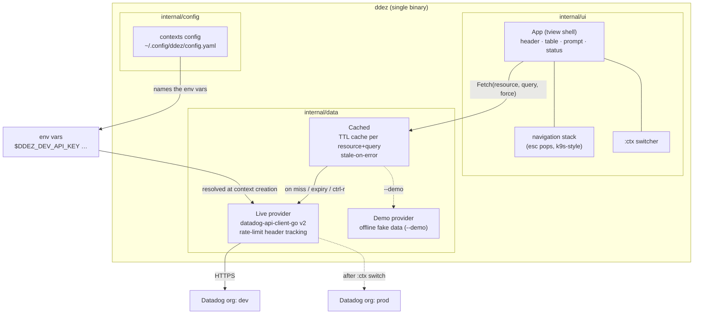
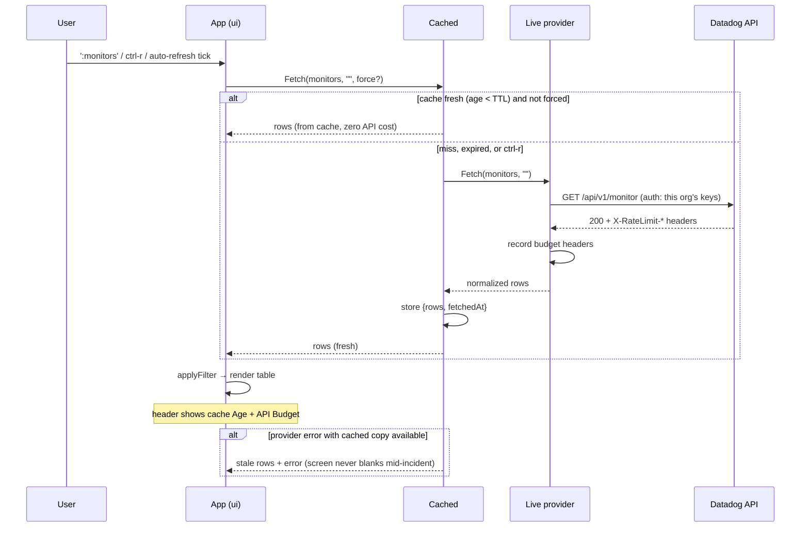
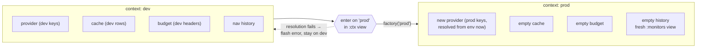
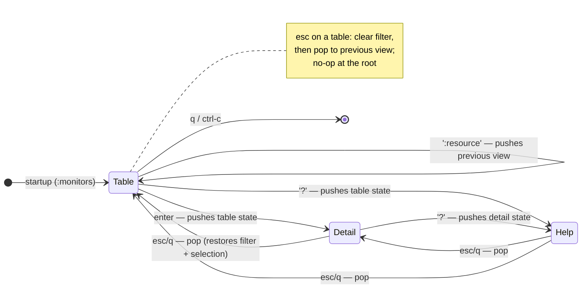

# ddez — Architecture

Companion to [DESIGN.md](DESIGN.md) (which holds the *why*); this document is
the *what and how*. Diagrams are Mermaid — GitHub renders them inline.

## Components

One binary, three layers. The UI never talks to Datadog directly: everything
goes through the TTL cache, and the cache talks to a swappable `Provider`.

Key property: `Provider` is an interface (`Fetch`, `Budget`, `Mode`, `Site`).
The demo provider implements it fully, which is what makes the entire TUI —
including context switching — testable headlessly with zero credentials.

## Data flow: one fetch

Datadog's API is rate-limited **per organization** (log search: 300 req/h),
so the cache is not an optimization — it is the core operational-safety
mechanism. See DESIGN.md § rate limits.

## Context switching (`:ctx`)

A context = one Datadog org (site + credentials), named in
`~/.config/ddez/config.yaml`. Secrets are **never** in the file — a context
either names the env vars that hold its credentials (`api-key-env` +
`app-key-env`, or `token-env` for bearer/access-token auth), or is marked
`keychain: true` with secrets in the OS keychain (macOS Keychain / Linux
Secret Service). Strict YAML parsing rejects inline `api-key:` fields.
Contexts can be managed in the TUI: `:ctx` → `a` opens an add form (masked
fields for either the key pair or a token, with an inline guidance panel),
`e` suspends into `$EDITOR` on the config file and reloads it on exit
(k9s-style), `ctrl-d` deletes (confirm modal; active context protected).
The UI performs these through injected `AddContext`/`DeleteContext`/
`ReloadContexts` callbacks — it never touches YAML or the keychain itself.

A switch is a hard boundary: different org means different data and a
different rate-limit budget, so everything org-scoped is torn down.

Startup context selection precedence: `--context` flag →
`$DDEZ_CONTEXT` → `current-context` in the config file. With no config file
at all, the classic `DD_API_KEY`/`DD_APP_KEY`/`DD_SITE` env vars become an
implicit `default` context, so pre-contexts usage keeps working.

## Navigation model

Mirrors k9s's page stack (`Pages` + `model.Stack` in k9s): every navigation
pushes the current state — resource, filter, selected row — and esc pops it.
Esc also clears an active filter on the way out (k9s `resetCmd` semantics).

The `:ctx` view is a pseudo-resource: rendered through the same table
pipeline (filter, colors, selection) but served from the app's own context
list instead of a Provider, and `enter` switches org instead of opening a
detail view.

## Security model

Reviewed 2026-07-14 (manual audit + govulncheck); full threat model in
[SECURITY.md](../SECURITY.md). The load-bearing controls, and where they
live:

| Control | Where |
|---|---|
| Site allowlist — creds only ever go to `api.<known site>` | `config.Sites` + `config.Load` validation; the :ctx dropdown reads the same list |
| No secrets in the config file (strict YAML, env/keychain only) | `config.Load` (`KnownFields`), `config.KeyringStore` |
| Atomic config writes, 0600/0700 modes | `config.Save`, log setup in `main.go` |
| No secret ever logged | logging sites in `internal/ui` record auth *kind* / context *name* only |
| https-only browser opens; no shell interpolation | `App.openURL`, `exec.Command` arg arrays throughout |
| Toolchain + dependency hygiene | `toolchain` pin in go.mod, govulncheck CI job, Dependabot |

## Package layout

| Path | Responsibility |
|---|---|
| `main.go` | flags, config loading, provider factory wiring |
| `internal/config` | contexts file: parse, validate, resolve env-indirected secrets |
| `internal/data` | `Provider` interface, `Cached` TTL cache, `Live` (Datadog API), `Demo` |
| `internal/ui` | tview shell, navigation stack, `:ctx` switcher, rendering |

Dependency direction is strictly `ui → data ← config` (via main); `data`
knows nothing about tview, `ui` knows nothing about YAML or env vars.

## Testing strategy

No pty, no credentials, no network:

- `internal/config`: table-driven unit tests (valid/implicit/reject-plaintext).
- `internal/ui`: the real `App` runs on a tcell `SimulationScreen`; tests
  inject keystrokes and assert on the rendered screen text. This covers
  command mode, filters, quick filters, help, detail, esc-history and
  context switching end-to-end.
- `TestScreenDump` (`DDEZ_DUMP=1`) regenerates the README screenshots from
  the same harness.
